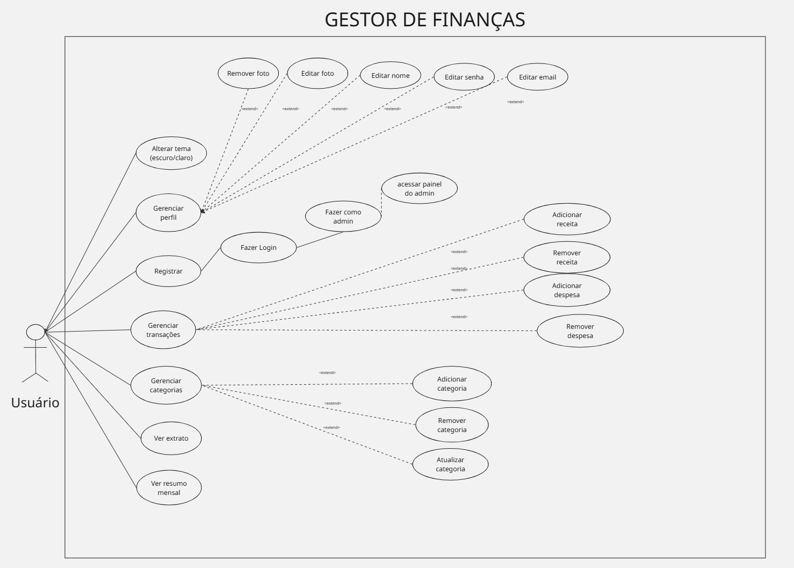
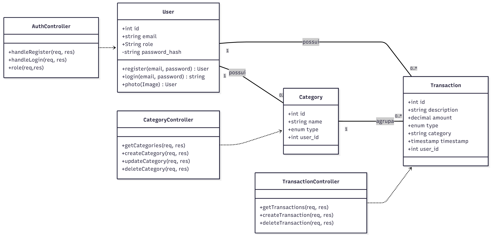

# Bem-vindo ao SEU app de Finanças Pessoais! 
# Feito por Gabriel Campos, Gabriel Couto e Vitória Jamile Freitas

## 📝 Descrição do Projeto

Este projeto é um aplicativo móvel para controle de finanças pessoais, desenvolvido para ajudar usuários a gerenciar suas despesas e receitas. O aplicativo fornece uma visão clara do saldo atual, um histórico completo de transações e resumos mensais.

O objetivo é oferecer uma ferramenta simples e eficiente para que o usuário tenha total controle sobre o seu dinheiro, com uma interface limpa e intuitiva.

---

## ✨ Funcionalidades

O aplicativo possui as seguintes funcionalidades principais:

* **Dashboard:** Uma tela inicial que exibe o saldo total e um resumo das últimas movimentações.
* **Registro de Transações:** Uma interface para o usuário adicionar novas despesas e receitas, com campos para valor, descrição e categoria.
* **Extrato:** Uma lista detalhada de todas as transações, permitindo ao usuário consultar o histórico financeiro completo.
* **Resumo Mensal:** Uma tela que resume o fluxo de caixa do mês, mostrando o total de receitas e despesas.
* **Categorias:** Gerenciamento de categorias para classificar as transações e facilitar a organização.

---

## 🛠️ Tecnologias Utilizadas

Este projeto foi construído utilizando as seguintes tecnologias e ferramentas:

* **React Native:** Framework para o desenvolvimento do aplicativo móvel, garantindo compatibilidade com iOS e Android.
* **Expo Router:** Sistema de roteamento nativo, que utiliza a estrutura de arquivos para gerenciar a navegação entre as telas.
* **NativeWind:** Biblioteca que permite a estilização do aplicativo com a sintaxe do Tailwind CSS, agilizando o desenvolvimento visual.
* **API REST:** O aplicativo é integrado a uma API REST para gerenciamento e persistência dos dados de finanças.
* **Banco de Dados:** Utilização de um banco de dados para armazenar as informações das transações de forma segura e eficiente.

---
Para rodar o app:

```bash
npm install
npx expo start
```
---

Para rodar o servidor:

```bash
cd server
node index.js
```
---

Para rodar testes:

```bash
cd server
npm test
```

## 📈 Diagrama de Casos de Uso



---

## 📈 Diagrama de Classes


<!--
This is an [Expo](https://expo.dev) project created with [`create-expo-app`](https://www.npmjs.com/package/create-expo-app).

## Get started

1. Install dependencies

   ```bash
   npm install
   ```

2. Start the app

   ```bash
   npx expo start
   ```

In the output, you'll find options to open the app in a

- [development build](https://docs.expo.dev/develop/development-builds/introduction/)
- [Android emulator](https://docs.expo.dev/workflow/android-studio-emulator/)
- [iOS simulator](https://docs.expo.dev/workflow/ios-simulator/)
- [Expo Go](https://expo.dev/go), a limited sandbox for trying out app development with Expo

You can start developing by editing the files inside the **app** directory. This project uses [file-based routing](https://docs.expo.dev/router/introduction).

## Get a fresh project

When you're ready, run:

```bash
npm run reset-project
```

This command will move the starter code to the **app-example** directory and create a blank **app** directory where you can start developing.

## Learn more

To learn more about developing your project with Expo, look at the following resources:

- [Expo documentation](https://docs.expo.dev/): Learn fundamentals, or go into advanced topics with our [guides](https://docs.expo.dev/guides).
- [Learn Expo tutorial](https://docs.expo.dev/tutorial/introduction/): Follow a step-by-step tutorial where you'll create a project that runs on Android, iOS, and the web.

## Join the community

Join our community of developers creating universal apps.

- [Expo on GitHub](https://github.com/expo/expo): View our open source platform and contribute.
- [Discord community](https://chat.expo.dev): Chat with Expo users and ask questions.
